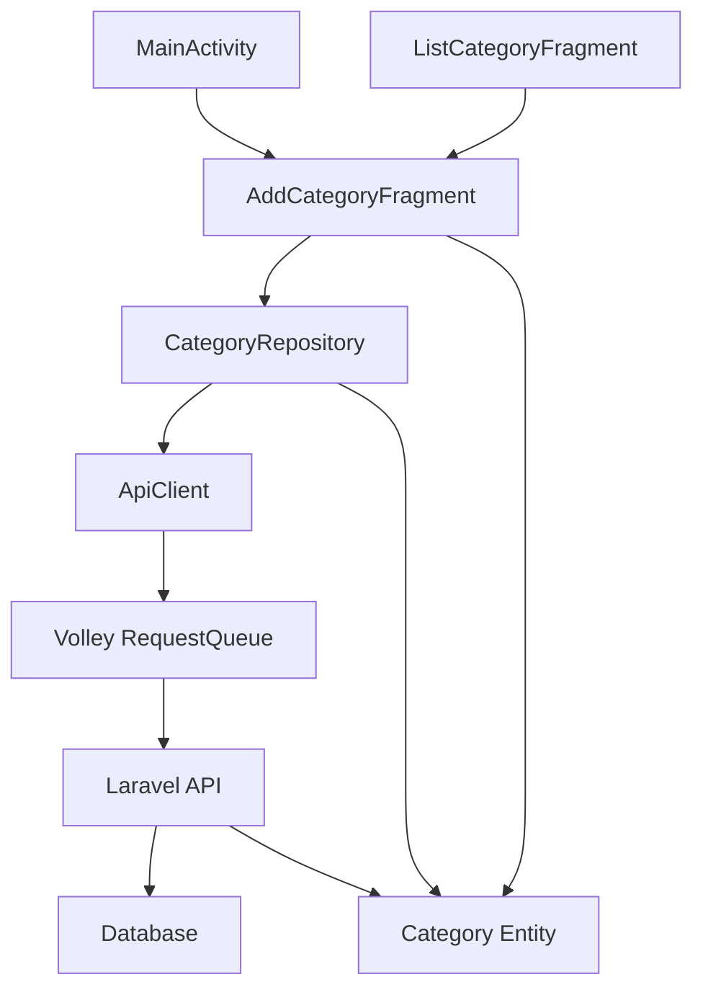
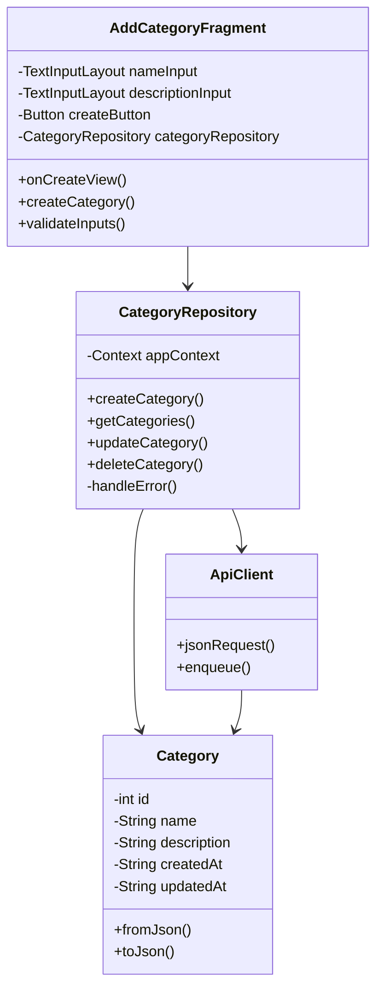

# Pharmacy Manager - Category Management System Documentation

## Table of Contents
1. [Overview](#overview)
2. [Architecture](#architecture)
3. [API Integration](#api-integration)
4. [UI Components](#ui-components)
5. [Data Models](#data-models)
6. [Implementation Guide](#implementation-guide)
7. [Usage Examples](#usage-examples)
8. [Error Handling](#error-handling)
9. [Testing Guide](#testing-guide)
10. [Troubleshooting](#troubleshooting)

## Overview

The Category Management System allows users to create, read, update, and delete product categories in the pharmacy management application. This feature integrates with a Laravel backend API and provides a clean, user-friendly interface for category management.

### Key Features
- ✅ Create new categories with name and description
- ✅ Form validation with user feedback
- ✅ API integration with Laravel backend
- ✅ Responsive Material Design UI
- ✅ Error handling and loading states
- ✅ Navigation and back button support

## Architecture

### System Components



### Class Relationships



## API Integration

### Backend Endpoint

#### Create Category
```
POST /api/v1/categories
Content-Type: application/json
Authorization: Bearer {token}

Request Body:
{
    "name": "Pain Relief",
    "description": "Medications for pain management"
}

Response (Success - 201):
{
    "data": {
        "type": "category",
        "id": 61,
        "attributes": {
            "name": "Pain Relief",
            "description": "Medications for pain management",
            "createdAt": "2025-09-25T20:43:02.000000Z",
            "updatedAt": "2025-09-25T20:43:02.000000Z"
        }
    }
}

Response (Error - 422):
{
    "message": "The given data was invalid.",
    "errors": {
        "name": ["The name field is required."],
        "description": ["The description field is required."]
    }
}
```

### Network Configuration

#### Headers
- **Content-Type**: `application/json`
- **Accept**: `application/json`
- **Authorization**: `Bearer {token}` (if user is authenticated)

#### Base URL
```java
public static final String BASE_URL = "http://192.168.1.102:8080/api/v1/";
```

## UI Components

### AddCategoryFragment Layout

#### Screen Structure
```
┌─────────────────────────────────────┐
│           Add New Category          │
│      Create a new product category  │
│                                     │
│  ┌─────────────────────────────────┐ │
│  │ Category Name                   │ │
│  │ [_____________________________] │ │
│  └─────────────────────────────────┘ │
│                                     │
│  ┌─────────────────────────────────┐ │
│  │ Description                     │ │
│  │ [_____________________________] │ │
│  │ [_____________________________] │ │
│  │ [_____________________________] │ │
│  └─────────────────────────────────┘ │
│                                     │
│  ┌─────────────────────────────────┐ │
│  │        Create Category          │ │
│  └─────────────────────────────────┘ │
│                                     │
│  ┌─────────────────────────────────┐ │
│  │         Back to List            │ │
│  └─────────────────────────────────┘ │
└─────────────────────────────────────┘
```

#### Layout File: `fragment_add_category.xml`
```xml
<androidx.constraintlayout.widget.ConstraintLayout>
    <ScrollView>
        <LinearLayout android:gravity="center">
            <!-- Header -->
            <TextView android:text="Add New Category" />
            <TextView android:text="Create a new product category" />
            
            <!-- Form -->
            <LinearLayout>
                <com.google.android.material.textfield.TextInputLayout
                    android:id="@+id/category_name"
                    android:hint="Category Name"
                    app:boxStrokeColor="@color/input_focused_border"
                    app:hintTextColor="@color/input_hint"
                    app:boxBackgroundColor="@color/input_background">
                    
                    <com.google.android.material.textfield.TextInputEditText
                        android:inputType="text"
                        android:textColor="@color/input_text"
                        android:textColorHint="@color/input_hint" />
                </com.google.android.material.textfield.TextInputLayout>
                
                <com.google.android.material.textfield.TextInputLayout
                    android:id="@+id/category_description"
                    android:hint="Description"
                    app:boxStrokeColor="@color/input_focused_border"
                    app:hintTextColor="@color/input_hint"
                    app:boxBackgroundColor="@color/input_background">
                    
                    <com.google.android.material.textfield.TextInputEditText
                        android:inputType="textMultiLine"
                        android:gravity="top"
                        android:layout_height="125dp"
                        android:textColor="@color/input_text"
                        android:textColorHint="@color/input_hint" />
                </com.google.android.material.textfield.TextInputLayout>
                
                <Button
                    android:id="@+id/create_category_btn"
                    android:text="Create Category"
                    android:backgroundTint="@color/MainColor" />
                    
                <Button
                    android:id="@+id/btnBack"
                    android:text="Back to List"
                    android:background="@color/transpirant" />
            </LinearLayout>
        </LinearLayout>
    </ScrollView>
</androidx.constraintlayout.widget.ConstraintLayout>
```

### Color Scheme
```xml
<!-- Input Field Colors -->
<color name="input_background">#FFFFFF</color>
<color name="input_border">#D1D5DB</color>
<color name="input_focused_border">#4F46E5</color>
<color name="input_text">#1F2937</color>
<color name="input_hint">#6B7280</color>

<!-- Primary Colors -->
<color name="MainColor">#4F46E5</color>
<color name="MainBackColor">#F8FAFC</color>
<color name="main_text_color">#0F172A</color>
<color name="secondary_text_color">#475569</color>
```

## Data Models

### Category Entity

#### Class Definition
```java
public class Category {
    private int id;
    private String name;
    private String description;
    private String createdAt;
    private String updatedAt;
    
    // Constructors
    public Category() {}
    public Category(int id, String name, String description, String createdAt, String updatedAt)
    
    // JSON Parsing
    public static Category fromJson(JSONObject json) throws JSONException
    public JSONObject toJson() throws JSONException
    
    // Getters and Setters
    public int getId()
    public void setId(int id)
    public String getName()
    public void setName(String name)
    // ... etc
}
```

#### JSON Parsing Example
```java
// Parse from API response
JSONObject data = json.getJSONObject("data");
JSONObject attributes = data.getJSONObject("attributes");

Category category = new Category(
    data.getInt("id"),
    attributes.getString("name"),
    attributes.getString("description"),
    attributes.getString("createdAt"),
    attributes.getString("updatedAt")
);

// Convert to API request
JSONObject requestBody = new JSONObject();
requestBody.put("name", category.getName());
requestBody.put("description", category.getDescription());
```

## Implementation Guide

### 1. Repository Layer

#### CategoryRepository.java
```java
public class CategoryRepository {
    private final Context appContext;
    
    public interface CategoryCallback {
        void onSuccess(Category category);
        void onError(String message);
    }
    
    public void createCategory(String name, String description, CategoryCallback callback) {
        try {
            JSONObject body = new JSONObject();
            body.put("name", name);
            body.put("description", description);
            
            ApiClient.enqueue(appContext, ApiClient.jsonRequest(
                appContext,
                Request.Method.POST,
                "categories",
                body,
                response -> {
                    try {
                        Category category = Category.fromJson(response);
                        callback.onSuccess(category);
                    } catch (JSONException e) {
                        callback.onError("Failed to parse category response: " + e.getMessage());
                    }
                },
                error -> handleError(error, callback)
            ));
        } catch (JSONException e) {
            callback.onError(e.getMessage());
        }
    }
}
```

### 2. UI Layer

#### AddCategoryFragment.java
```java
public class AddCategoryFragment extends Fragment {
    private TextInputLayout nameInput, descriptionInput;
    private Button createButton;
    private CategoryRepository categoryRepository;
    
    @Override
    public View onCreateView(LayoutInflater inflater, ViewGroup container, Bundle savedInstanceState) {
        View view = inflater.inflate(R.layout.fragment_add_category, container, false);
        
        // Initialize views
        nameInput = view.findViewById(R.id.category_name);
        descriptionInput = view.findViewById(R.id.category_description);
        createButton = view.findViewById(R.id.create_category_btn);
        
        // Initialize repository
        categoryRepository = new CategoryRepository(requireContext());
        
        // Set up listeners
        createButton.setOnClickListener(v -> createCategory());
        
        return view;
    }
    
    private void createCategory() {
        if (!validateInputs()) return;
        
        String name = nameInput.getEditText().getText().toString().trim();
        String description = descriptionInput.getEditText().getText().toString().trim();
        
        createButton.setEnabled(false);
        createButton.setText("Creating...");
        
        categoryRepository.createCategory(name, description, new CategoryRepository.CategoryCallback() {
            @Override
            public void onSuccess(Category category) {
                createButton.setEnabled(true);
                createButton.setText("Create Category");
                Toast.makeText(requireContext(), "Category created successfully!", Toast.LENGTH_SHORT).show();
                // Clear form and navigate back
                clearForm();
                getActivity().onBackPressed();
            }
            
            @Override
            public void onError(String message) {
                createButton.setEnabled(true);
                createButton.setText("Create Category");
                Toast.makeText(requireContext(), "Error: " + message, Toast.LENGTH_LONG).show();
            }
        });
    }
}
```

### 3. Navigation Integration

#### MainActivity.java
```java
public class MainActivity extends AppCompatActivity {
    // Method to navigate to AddCategoryFragment
    public void navigateToAddCategory() {
        getSupportFragmentManager().beginTransaction()
                .replace(R.id.fragement_container, new AddCategoryFragment())
                .addToBackStack(null)
                .commit();
    }
}
```

## Usage Examples

### 1. Creating a Category

#### Step-by-Step Process
1. **Navigate** to AddCategoryFragment
2. **Enter category name**: "Pain Relief"
3. **Enter description**: "Medications for pain management"
4. **Click "Create Category"**
5. **Loading state**: Button shows "Creating..."
6. **API call**: POST to `/api/v1/categories`
7. **Success**: Toast message + navigate back
8. **Error**: Error message + enable button

#### Code Example
```java
// In your activity or fragment
MainActivity mainActivity = (MainActivity) getActivity();
mainActivity.navigateToAddCategory();
```

### 2. Form Validation

#### Client-Side Validation
```java
private boolean validateInputs() {
    boolean isValid = true;
    
    // Validate name
    String name = nameInput.getEditText().getText().toString().trim();
    if (name.isEmpty()) {
        nameInput.setError("Category name is required");
        isValid = false;
    } else if (name.length() < 2) {
        nameInput.setError("Category name must be at least 2 characters");
        isValid = false;
    } else {
        nameInput.setError(null);
        nameInput.setErrorEnabled(false);
    }
    
    // Validate description
    String description = descriptionInput.getEditText().getText().toString().trim();
    if (description.isEmpty()) {
        descriptionInput.setError("Description is required");
        isValid = false;
    } else if (description.length() < 5) {
        descriptionInput.setError("Description must be at least 5 characters");
        isValid = false;
    } else {
        descriptionInput.setError(null);
        descriptionInput.setErrorEnabled(false);
    }
    
    return isValid;
}
```

## Error Handling

### 1. Network Errors
```java
private void handleError(VolleyError error, CategoryCallback callback) {
    String message = error.getMessage();
    if (error.networkResponse != null) {
        String body = null;
        try {
            body = new String(error.networkResponse.data);
        } catch (Exception ignored) {}
        message = "HTTP " + error.networkResponse.statusCode + 
                 (body != null ? (": " + body) : "");
    }
    if (message == null) message = "Unknown error";
    Log.e("CategoryRepository", "Category request failed: " + message, error);
    callback.onError(message);
}
```

### 2. Common Error Scenarios

#### Client-Side Errors
- **Empty fields**: "Category name is required"
- **Short names**: "Category name must be at least 2 characters"
- **Short descriptions**: "Description must be at least 5 characters"

#### Server-Side Errors
- **Validation errors (422)**: Server validation messages
- **Unauthorized (401)**: "Invalid or expired token"
- **Server error (500)**: "Internal server error"
- **Network error**: "Network connection failed"

### 3. User Feedback
```java
// Success feedback
Toast.makeText(requireContext(), "Category created successfully!", Toast.LENGTH_SHORT).show();

// Error feedback
Toast.makeText(requireContext(), "Error: " + message, Toast.LENGTH_LONG).show();

// Loading state
createButton.setText("Creating...");
createButton.setEnabled(false);
```

## Testing Guide

### 1. Unit Testing

#### Test Category Entity
```java
@Test
public void testCategoryFromJson() throws JSONException {
    JSONObject json = new JSONObject();
    JSONObject data = new JSONObject();
    JSONObject attributes = new JSONObject();
    
    attributes.put("name", "Test Category");
    attributes.put("description", "Test Description");
    data.put("id", 1);
    data.put("attributes", attributes);
    json.put("data", data);
    
    Category category = Category.fromJson(json);
    
    assertEquals(1, category.getId());
    assertEquals("Test Category", category.getName());
    assertEquals("Test Description", category.getDescription());
}
```

### 2. Integration Testing

#### Test API Integration
```java
@Test
public void testCreateCategory() {
    CategoryRepository repository = new CategoryRepository(context);
    
    repository.createCategory("Test Category", "Test Description", new CategoryRepository.CategoryCallback() {
        @Override
        public void onSuccess(Category category) {
            assertNotNull(category);
            assertEquals("Test Category", category.getName());
        }
        
        @Override
        public void onError(String message) {
            fail("Category creation failed: " + message);
        }
    });
}
```

### 3. UI Testing

#### Test Form Validation
```java
@Test
public void testFormValidation() {
    AddCategoryFragment fragment = new AddCategoryFragment();
    
    // Test empty name
    assertFalse(fragment.validateInputs());
    
    // Test short name
    nameInput.getEditText().setText("A");
    assertFalse(fragment.validateInputs());
    
    // Test valid input
    nameInput.getEditText().setText("Valid Category");
    descriptionInput.getEditText().setText("Valid Description");
    assertTrue(fragment.validateInputs());
}
```

## Troubleshooting

### Common Issues

#### 1. API Connection Issues
**Problem**: "Network error" or "Connection failed"
**Solutions**:
- Check internet connection
- Verify server URL in `ApiConfig.java`
- Check network security config for HTTP/HTTPS
- Ensure server is running

#### 2. Authentication Issues
**Problem**: "HTTP 401: Unauthorized"
**Solutions**:
- Check if user is logged in
- Verify token is valid and not expired
- Check Authorization header format

#### 3. Validation Errors
**Problem**: "HTTP 422: Validation failed"
**Solutions**:
- Check server validation rules
- Ensure all required fields are provided
- Verify field formats match server expectations

#### 4. UI Issues
**Problem**: Form not submitting or validation not working
**Solutions**:
- Check if button click listener is set
- Verify input field IDs match layout
- Check if validation method is called

### Debug Tips

#### 1. Enable Logging
```java
// Add to CategoryRepository
Log.d("CategoryRepository", "Create category request body=" + body.toString());
Log.d("CategoryRepository", "Create category response=" + response.toString());
Log.e("CategoryRepository", "Category request failed: " + message, error);
```

#### 2. Check Network Requests
- Use browser dev tools or Postman to test API endpoints
- Verify request headers and body format
- Check server logs for errors

#### 3. UI Debugging
- Use Android Studio Layout Inspector
- Check if views are properly initialized
- Verify click listeners are attached

## File Structure

```
app/src/main/java/com/example/pharmacymanager/
├── data/
│   ├── entities/
│   │   └── Category.java
│   └── repositories/
│       └── CategoryRepository.java
└── ui/
    ├── category/
    │   └── AddCategoryFragment.java
    └── MainActivity.java

app/src/main/res/
├── layout/
│   └── fragment_add_category.xml
└── values/
    └── colors.xml
```

## Dependencies

```gradle
implementation 'com.android.volley:volley:1.2.1'
implementation 'com.google.android.material:material:1.9.0'
```

## Future Enhancements

### Planned Features
- [ ] Category image upload
- [ ] Category color coding
- [ ] Bulk category operations
- [ ] Category search and filtering
- [ ] Category hierarchy support
- [ ] Offline category management

### Performance Optimizations
- [ ] Category caching
- [ ] Lazy loading for large lists
- [ ] Image compression
- [ ] Network request optimization

This documentation provides a complete guide for understanding, implementing, and maintaining the category management system in your pharmacy application.


