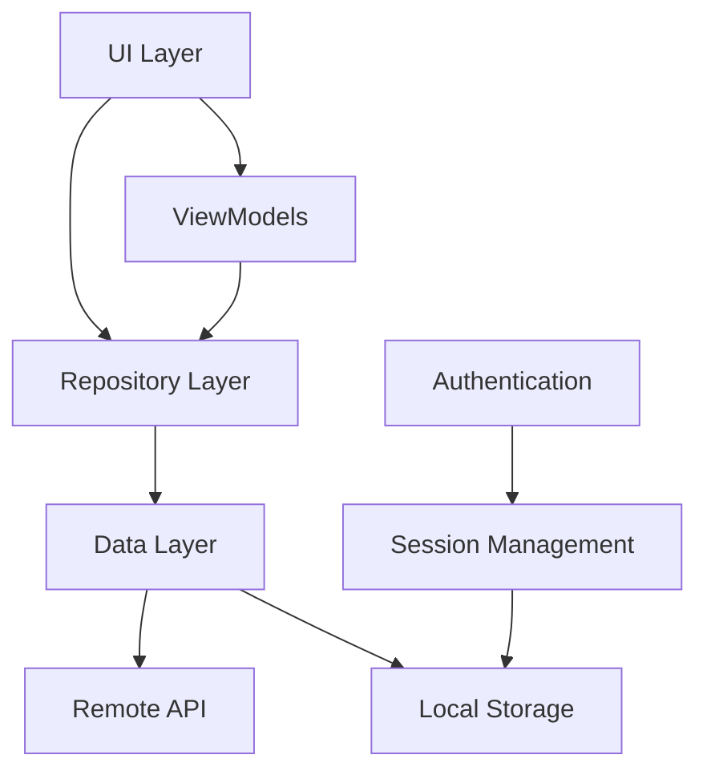

# PharmacyManager - Complete Project Documentation

## Table of Contents
1. [Project Overview](#project-overview)
2. [Architecture](#architecture)
3. [Project Structure](#project-structure)
4. [Core Components](#core-components)
5. [Data Layer](#data-layer)
6. [UI Components](#ui-components)
7. [Authentication System](#authentication-system)
8. [Category Management](#category-management)
9. [API Integration](#api-integration)
10. [Build Configuration](#build-configuration)
11. [Resources](#resources)
12. [Security Configuration](#security-configuration)
13. [Development Setup](#development-setup)
14. [Features](#features)
15. [Future Enhancements](#future-enhancements)

---

## Project Overview

**PharmacyManager** is a comprehensive Android application designed for pharmacy management. The app provides a modern, user-friendly interface for managing pharmaceutical operations including user authentication, category management, and product handling.

### Key Information
- **Package Name**: `com.example.pharmacymanager`
- **Target SDK**: 36 (Android 14)
- **Minimum SDK**: 24 (Android 7.0)
- **Language**: Java
- **Architecture**: Repository Pattern with MVVM principles
- **Backend Integration**: Laravel API

---

## Architecture

The application follows a clean architecture pattern with clear separation of concerns:



### Architecture Components:
- **UI Layer**: Activities, Fragments, Adapters
- **Repository Layer**: Data access abstraction
- **Data Layer**: Entities, API clients, local storage
- **Network Layer**: Volley-based HTTP client

---

## Project Structure

```
app/
├── src/main/
│   ├── java/com/example/pharmacymanager/
│   │   ├── data/
│   │   │   ├── entities/          # Data models
│   │   │   ├── repositories/      # Data access layer
│   │   │   ├── remote/            # API clients
│   │   │   └── local/             # Local storage
│   │   └── ui/
│   │       ├── auth/              # Authentication screens
│   │       ├── category/          # Category management
│   │       ├── home/              # Home screen
│   │       └── product/           # Product management
│   ├── res/
│   │   ├── layout/                # XML layouts
│   │   ├── values/                # Strings, colors, themes
│   │   ├── drawable/              # Icons and images
│   │   ├── menu/                  # Navigation menus
│   │   └── xml/                   # Configuration files
│   └── AndroidManifest.xml
├── build.gradle.kts               # App-level dependencies
└── proguard-rules.pro            # Code obfuscation rules
```

---

## Core Components

### 1. Activities

#### SplashActivity
- **Purpose**: Application entry point with animated splash screen
- **Features**: 
  - 5-second delay with animations
  - Smooth transition to LoginActivity
  - Full-screen immersive experience

#### LoginActivity
- **Purpose**: User authentication
- **Features**:
  - Email and password validation
  - Material Design input fields
  - Smooth transitions to SignupActivity
  - Integration with AuthRepository

#### SignupActivity
- **Purpose**: New user registration
- **Features**:
  - Comprehensive form validation
  - Username, email, password, and confirmation fields
  - Real-time validation feedback
  - Automatic navigation to login after successful registration

#### MainActivity
- **Purpose**: Main application container with navigation drawer
- **Features**:
  - Navigation drawer with menu items
  - Fragment container for dynamic content
  - Toolbar with drawer toggle
  - Back button handling

### 2. Fragments

#### HomeFragment
- **Purpose**: Dashboard and welcome screen
- **Status**: Basic implementation (placeholder)

#### ListCategoryFragment
- **Purpose**: Display and manage product categories
- **Features**:
  - RecyclerView with category list
  - Floating action button for adding categories
  - Progress indicators and empty states
  - Pull-to-refresh functionality (prepared)

#### AddCategoryFragment
- **Purpose**: Create new product categories
- **Features**:
  - Form validation
  - Real-time input validation
  - Success/error feedback
  - Automatic navigation back to list

#### ListProductFragment
- **Purpose**: Display and manage products
- **Status**: Basic implementation (placeholder)

---

## Data Layer

### Entities

#### Category.java
```java
public class Category {
    private int id;
    private String name;
    private String description;
    private String createdAt;
    private String updatedAt;
    
    // JSON serialization/deserialization methods
    public static Category fromJson(JSONObject json);
    public JSONObject toJson();
}
```

#### User.java
```java
public class User {
    private long id;
    private String uuid;
    private String name;
    private String email;
    private String phone;
    private String address;
    // ... additional fields
}
```

### Repositories

#### AuthRepository
- **Purpose**: Handle user authentication operations
- **Methods**:
  - `register(String username, String email, String password, AuthCallback callback)`
  - `login(String email, String password, AuthCallback callback)`
- **Features**: Token management, error handling, response parsing

#### CategoryRepository
- **Purpose**: Manage category CRUD operations
- **Methods**:
  - `createCategory(String name, String description, CategoryCallback callback)`
  - `getCategories(CategoryListCallback callback)`
  - `updateCategory(int categoryId, String name, String description, CategoryCallback callback)`
  - `deleteCategory(int categoryId, CategoryCallback callback)`

### Remote Data Sources

#### ApiClient
- **Purpose**: Centralized HTTP request handling
- **Features**:
  - Automatic token injection
  - Request/response logging
  - Error handling
  - JSON request/response support

#### RequestQueueSingleton
- **Purpose**: Singleton pattern for Volley RequestQueue
- **Features**: Thread-safe initialization, application-wide request management

#### ApiConfig
- **Purpose**: API endpoint configuration
- **Features**: Base URL management, endpoint building

### Local Storage

#### SessionManager
- **Purpose**: Manage user session and authentication tokens
- **Features**:
  - Token storage using SharedPreferences
  - Session persistence across app restarts
  - Secure token management

---

## UI Components

### Adapters

#### CategoryAdapter
- **Purpose**: RecyclerView adapter for category list display
- **Features**:
  - Click and long-click listeners
  - Dynamic data updates
  - Date formatting
  - Empty state handling

### Layouts

#### Main Layouts
- `activity_main.xml`: Main container with drawer layout
- `activity_login.xml`: Login form with Material Design
- `activity_sign_up.xml`: Registration form
- `activity_splash.xml`: Animated splash screen

#### Fragment Layouts
- `fragment_list_category.xml`: Category list with RecyclerView
- `fragment_add_category.xml`: Category creation form
- `fragment_home.xml`: Home dashboard
- `fragment_list_product.xml`: Product list (placeholder)

#### Component Layouts
- `rv_category_list_template.xml`: Category item template
- `nav_header.xml`: Navigation drawer header

---

## Authentication System

### Flow
1. **Splash Screen** → **Login Screen**
2. **Login** → **Main Application**
3. **Signup** → **Login Screen**

### Features
- Email validation with regex patterns
- Password confirmation for registration
- Token-based authentication
- Session persistence
- Secure token storage

### Validation Rules
- **Email**: Standard email format validation
- **Username**: 4-15 characters, alphanumeric with dots/underscores
- **Password**: Non-empty validation
- **Password Confirmation**: Must match original password

---

## Category Management

### Features
- ✅ Create new categories
- ✅ List all categories
- ✅ Form validation
- ✅ Error handling
- ✅ Loading states
- ✅ Empty state handling

### API Integration
- **Create**: `POST /categories`
- **Read**: `GET /categories`
- **Update**: `PUT /categories/{id}`
- **Delete**: `DELETE /categories/{id}`

### UI Flow
1. **List View** → **Add Category** → **Form Validation** → **API Call** → **Success/Error** → **Return to List**

---

## API Integration

### Configuration
- **Base URL**: Configurable through ApiConfig
- **Authentication**: Bearer token in Authorization header
- **Content-Type**: `application/json`
- **Accept**: `application/json`

### Request Format
```json
{
  "name": "Category Name",
  "description": "Category Description"
}
```

### Response Format
```json
{
  "data": {
    "id": 1,
    "attributes": {
      "name": "Category Name",
      "description": "Category Description",
      "createdAt": "2024-01-01T00:00:00.000Z",
      "updatedAt": "2024-01-01T00:00:00.000Z"
    }
  }
}
```

---

## Build Configuration

### Dependencies
```kotlin
dependencies {
    // AndroidX UI & Support
    implementation(libs.appcompat)
    implementation(libs.material)
    implementation(libs.activity)
    implementation(libs.constraintlayout)

    // Volley (Network / API)
    implementation(libs.volley)

    // Lifecycle Components (ViewModel & LiveData)
    implementation(libs.lifecycle.viewmodel)
    implementation(libs.lifecycle.livedata)
    implementation(libs.lifecycle.runtime)

    // Gson (For parsing JSON)
    implementation(libs.gson)
    implementation(libs.fragment)

    // Navigation
    implementation(libs.navigation.fragment.ktx)
    implementation(libs.navigation.ui.ktx)

    // Material Design Components
    implementation(libs.material.v1110)
    
    // SwipeRefreshLayout
    implementation("androidx.swiperefreshlayout:swiperefreshlayout:1.1.0")

    // Testing
    testImplementation(libs.junit)
    androidTestImplementation(libs.ext.junit)
    androidTestImplementation(libs.espresso.core)
}
```

### Build Features
- **View Binding**: Enabled
- **Data Binding**: Enabled
- **Java Version**: 11
- **Compile SDK**: 36
- **Target SDK**: 36
- **Min SDK**: 24

---

## Resources

### Colors
The app uses a modern color palette:
- **Primary**: `#4F46E5` (Indigo)
- **Background**: `#F8FAFC` (Light Gray)
- **Success**: `#66BB6A` (Green)
- **Error**: `#EF5350` (Red)
- **Warning**: `#FFA726` (Orange)

### Strings
- Multilingual support (French/English)
- Consistent naming conventions
- User-friendly messages

### Navigation Menu
- Home
- Products
- Categories
- About
- Logout

---

## Security Configuration

### Network Security
- **Cleartext Traffic**: Permitted for development
- **Allowed Domains**: 
  - `192.168.1.27` (Local development)
  - `10.0.2.2` (Android emulator)
  - `127.0.0.1` (Localhost)

### Permissions
- `INTERNET`: Required for API communication

---

## Development Setup

### Prerequisites
- Android Studio Arctic Fox or later
- Android SDK 24+
- Java 11
- Gradle 8.13.0

### Setup Steps
1. Clone the repository
2. Open in Android Studio
3. Sync Gradle files
4. Configure API endpoints in `ApiConfig.java`
5. Update network security config for your development environment
6. Build and run

### API Configuration
Update the base URL in `ApiConfig.java`:
```java
public static final String BASE_URL = "http://your-api-domain.com/api/";
```

---

## Features

### Implemented Features
- ✅ User Authentication (Login/Register)
- ✅ Category Management (CRUD)
- ✅ Material Design UI
- ✅ Navigation Drawer
- ✅ Form Validation
- ✅ Error Handling
- ✅ Loading States
- ✅ Session Management
- ✅ API Integration
- ✅ Responsive Design

### Partially Implemented
- 🔄 Product Management (UI ready, backend integration pending)
- 🔄 Home Dashboard (placeholder)

### Not Implemented
- ❌ Order Management
- ❌ Customer Management
- ❌ Inventory Tracking
- ❌ Reporting
- ❌ Offline Support
- ❌ Push Notifications

---

## Future Enhancements

### Short Term
1. Complete Product Management implementation
2. Add Edit/Delete functionality for categories
3. Implement proper error handling with retry mechanisms
4. Add data caching for offline support
5. Implement search functionality

### Medium Term
1. Add Order Management system
2. Implement Customer Management
3. Add Inventory tracking
4. Create reporting dashboard
5. Add data export functionality

### Long Term
1. Add multi-language support
2. Implement role-based access control
3. Add barcode scanning
4. Integrate with external pharmacy systems
5. Add analytics and reporting

---

## Technical Notes

### Code Quality
- Follows Android development best practices
- Uses Repository pattern for data access
- Implements proper error handling
- Includes comprehensive logging
- Follows Material Design guidelines

### Performance Considerations
- Uses RecyclerView for efficient list rendering
- Implements proper memory management
- Uses singleton pattern for network requests
- Implements loading states for better UX

### Security Considerations
- Token-based authentication
- Secure token storage
- Input validation
- Network security configuration

---

## Conclusion

The PharmacyManager application provides a solid foundation for pharmacy management with a modern, user-friendly interface. The architecture is scalable and follows Android development best practices. The current implementation focuses on user authentication and category management, with a clear path for future enhancements.

The codebase is well-structured, documented, and ready for further development. The use of modern Android development practices ensures maintainability and scalability for future features.

---

*Last Updated: January 2024*
*Version: 1.0*
*Author: Development Team*
